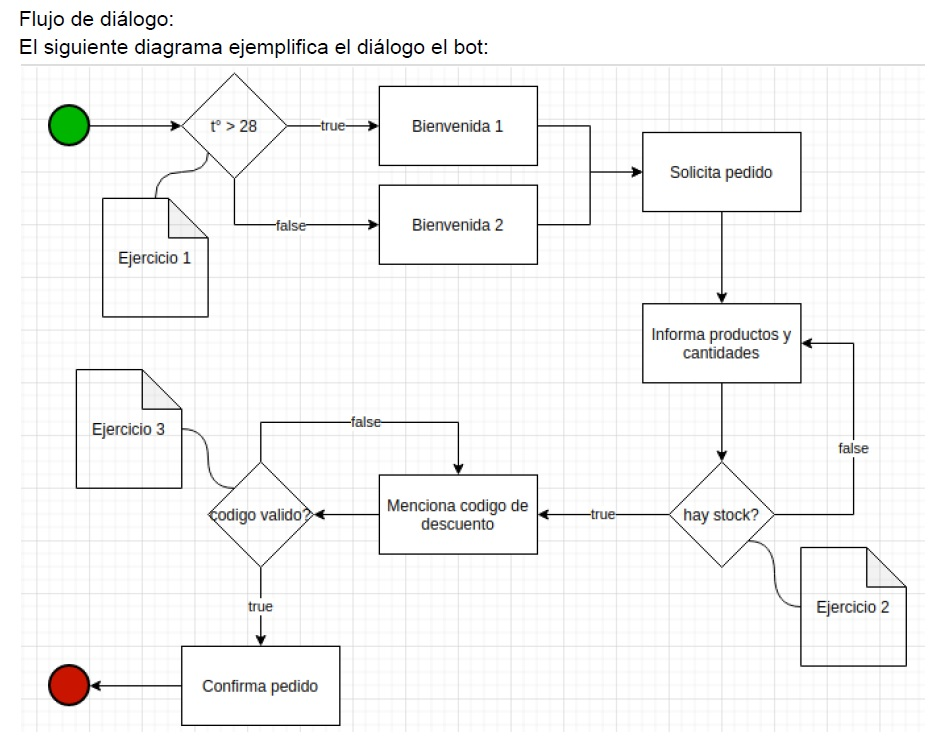

# Challenge
## Introducción:
El cliente Heladerías Frozen SRL nos solicita la construcción de un bot para la toma de
pedidos. Usted forma parte del equipo asignado a este proyecto y tiene como responsabilidad
el desarrollo de funciones auxiliares que le darán al bot la capacidad de desenvolverse en la
conversación.

## Enunciado:
Como se puede observar en el diagrama, en determinados momentos, el bot necesitará realizar
validaciones externas para evaluar cómo continuar.
A continuación, se define el alcance de esas funciones y se solicita desarrollar las mismas.
Ejercicio 1:
Completar el método is_hot_in_pehuajo con el siguiente objetivo:
● Consultar la información de clima y devolver True si la temperatura actual supera los 28
grados celsius o False caso contrario. Esto implica incluso devolver False ante cualquier
excepción http.
Información extra:
API Información de clima:
Link a documentacion: https://openweathermap.org/current#geo
Utilice para comenzar:

import requests
class GeoAPI:
API_KEY = "d81015613923e3e435231f2740d5610b"
LAT = "-35.836948753554054"
LON = "-61.870523905384076"
@classmethod
def is_hot_in_pehuajo(cls):
pass

## Ejercicio 2.1:
Dadas las variables: product_name y quantity, complete la función is_product_available con el
siguiente objetivo:
● Buscar en un pandas DataFrame y devolver True si existe stock, False caso contrario.
Utilice para comenzar:

import pandas as pd
_PRODUCT_DF = pd.DataFrame({"product_name": ["Chocolate", "Granizado",
"Limon", "Dulce de Leche"], "quantity": [3,10,0,5]})
def is_product_available(product_name, quantity):
pass

### Ejercicio 2.2:
Si miramos el diagrama de flujo al momento de la decisión de stock, encontramos un
potencial loop infinito, ya que el usuario podría continuar ingresando productos inválidos
o sin stock. Reformule la función para solucionar este problema.

## Ejercicio 3:
Completar la función validate_discount_code con el siguiente objetivo:
● Dada la lista de códigos de descuento vigentes y un código de descuento mencionado
por el cliente, devuelve True si la diferencia entre el código mencionado y los códigos
vigentes es menor a tres caracteres, en al menos uno de los casos.
Por diferencia se entiende: caracteres que están presentes en el código brindado, pero no en el
código evaluado de la lista o viceversa.
Utilice para comenzar:

_AVAILABLE_DISCOUNT_CODES = ["Primavera2021", "Verano2021", "Navidad2x1",
"heladoFrozen"]
def validate_discount_code(discount_code):
"""
Ejemplo:
"primavera2021" deberia devolver True, ya que al compararlo:
vs "Primavera2021" = 2 caracteres de diferencia ("p" y "P")
vs "Verano2021" = 7 caracteres de diferencia ('i', 'n', 'o', 'm', 'V',
'p', 'v')
vs "Navidad2x1" = 8 caracteres de diferencia ('N', 'm', '0', 'x', 'e',
'd', 'p', 'r')
vs "heladoFrozen" = 14 caracteres de diferencia ('z', 'i', 'v', 'n',
'o', 'm', '2', '0', 'd', 'p', '1', 'F', 'h', 'l')
"""
